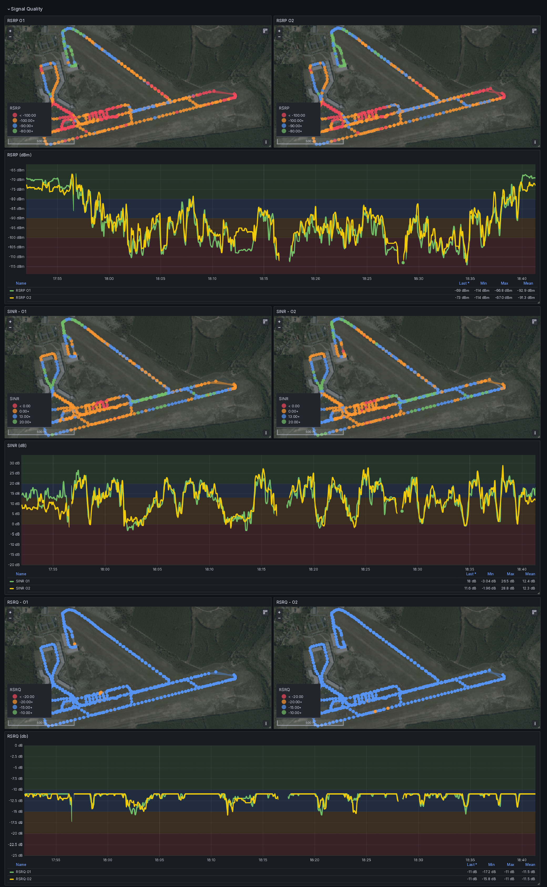
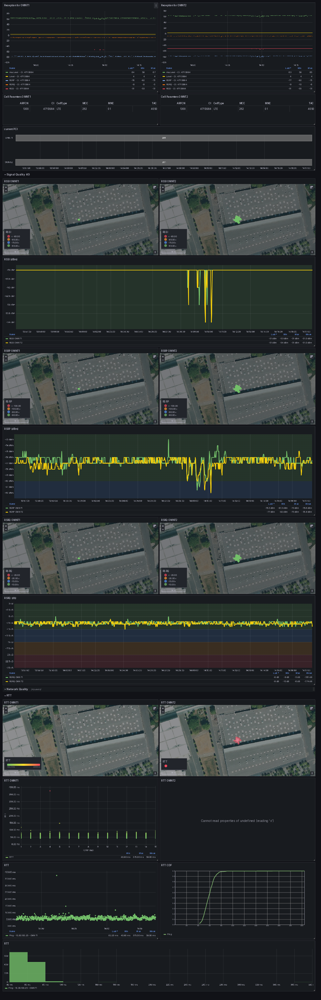
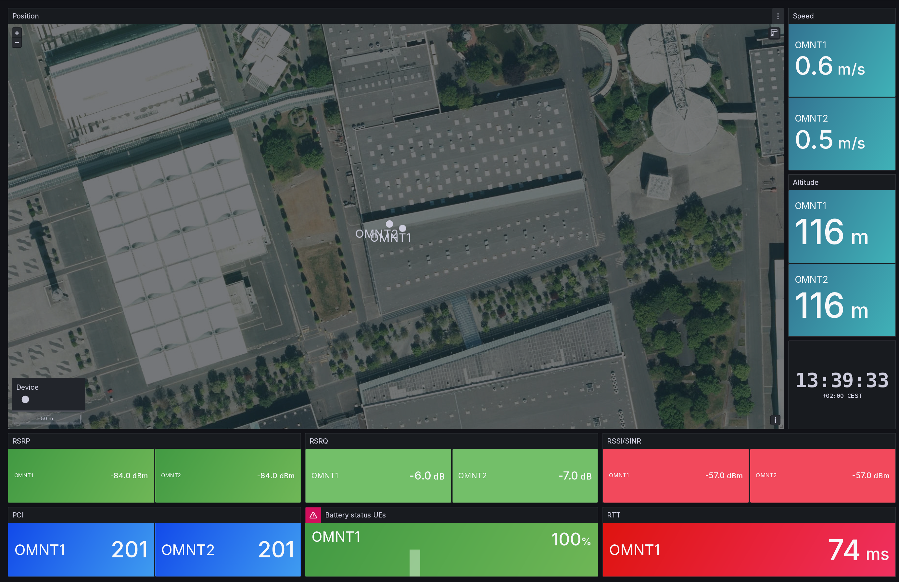

# Grafana Dashboard
To import the Dashboard into Grafana, you can use 
[this](https://grafana.com/docs/grafana/latest/dashboards/build-dashboards/import-dashboards/) indruction.
Please note that you need to have Connection `InfluxDB` configured in [Grafana](https://grafana.com/docs/grafana/latest/getting-started/get-started-grafana-influxdb/), with the query language set to `Flux`.
All our Dashboards are currently using Flux as the query language.
## Example Screenshots
We are currently investigating solutions to provide a live demo of the Grafana Dashboards.
Currently, we can only provide screenshots of the Dashboards.

### Detail 5G

5G RSRP/RSRQ/SINR measurements with two devices plotted with Location and over Time. 
A drive test was conducted.
### Detail 4G

4G RSRP/RSRQ/RSSI and RTT measurements with two devices plotted with Location and over Time.
Telekom (DE) network at Hannover Fair 2024.
### Overview

General overview Dashboard of current reporting Devices.

### Versions
- Grafana: `grafana version 11.0.0-preview`, also tested with `grafana version 10.X`
- InfluxDB: `InfluxDB v2.7.5 (git: 09a9607fd9) build_date: 2024-01-05T17:17:04Z`

### External Plugins
- [CDF - Cumulative Distribution Function](https://grafana.com/grafana/plugins/sebastiangunreben-cdf-panel/)

